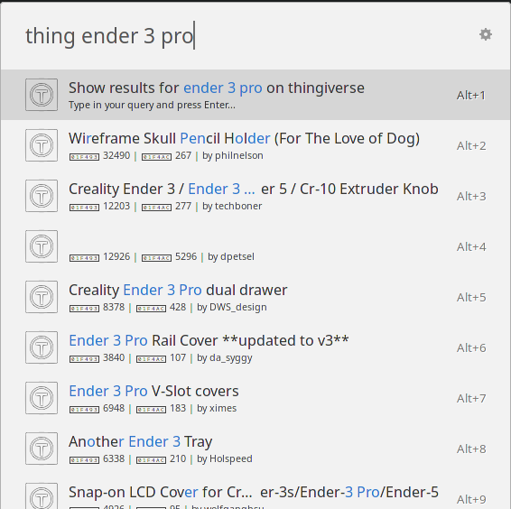

# Ulauncher Thingiverse 
Ulauncher extension for quick access to search results from thingiverse.

## Overview

Once you install this extension, just start Ulauncher and type: `thing`. That will start the extension.


From there you can type your search query like `Ender 3 Pro`:



Note that the first item in the list allows you to view the search results in the browser.

(Excuse the weird glyphs, still need to configure emoji on my Arch install. 
 The first one is :thumbs_up: and the second one is :speech_balloon:)

## Installation

Open ulauncher preferences window -> extensions -> add extension and paste the following url:

```
https://github.com/subutux/ulauncher-thingiverse
```

## Development

```
git clone git@github.com:subutux/ulauncher-thingiverse.git
cd ulauncher-thingiverse
make attach
```

The `make attach` command will symlink the cloned repo into the appropriate location on the ulauncher extensions folder. _If the extensions folder does not exist, create it and run the command again._

Make sure Ulauncher is not running and from command line run:

```sh
ulauncher --no-extensions --dev -v |& grep "thingiverse"
```

This will start ulauncher with all the extensions disabled which will make it easier to look for logs.

You then have to start the Laravel extension manually. In the output of the previous command you should find something similar to this:

```sh
VERBOSE=1 ULAUNCHER_WS_API=ws://127.0.0.1:5054/ulauncher-thingiverse PYTHONPATH=/usr/lib/python3/dist-packages /usr/bin/python3 /home/mabasic/.cache/ulauncher_cache/extensions/ulauncher-thingiverse/main.py
```

Copy and run that command in another terminal window.

Your extension should now be running. To see your changes, just Ctrl+C and re-run the last command.

## License

Ulauncher thingiverse Extension is open-source software licensed under the [MIT license](https://opensource.org/licenses/MIT).